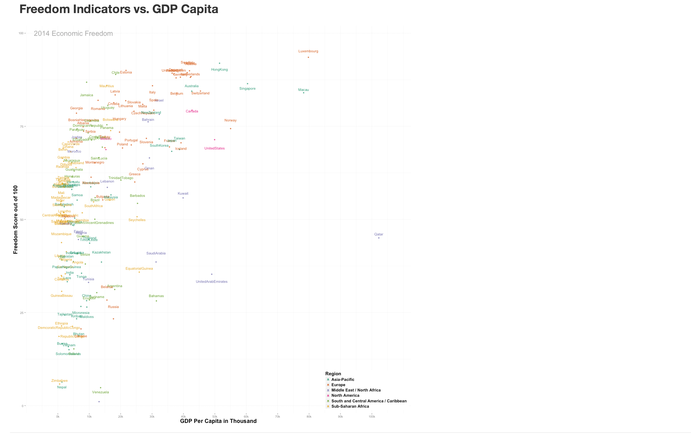
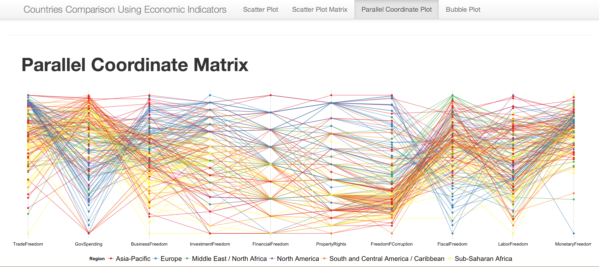

Final Project
==============================

| **Name**  | Dinglin Huo  |
|----------:|:-------------|
| **Email** | dhuo@dons.usfca.edu |

###Project Dataset###

The dataset are obtained from The Heritage Foundation website, the dataset name is 2014 Index of Economic Freedom. mydataset contains 175 rows, representing 175 countries around the world, and 33 columns representing differents kinds of economical indicators, within there are different types of economic freedom indicators.

I cleaned my dataset and set the numeric values using `as.numeric()`, set the categorical value using `as.factor()` and get them ready for plotting. Also,I use `gsub()` to get ride of the non-readable characters in my coloumns, and set a `thousan_formatter` to prepare for axis text use,also I set the my variables to a global environment using `globalenv()` so all my plot could get access to this cleaned out dataset.

Packages I used for this project:

- library(ggplot2)
- library(shiny)
- library(grid)
- library(scales)
- library(reshape2)
- library(data.table)
- library(GGally)

### Introduction###

There are 4 types of Visualizations 

- 1. Scatter word plot
- 2. Scatterplot Matrix
- 3. Parallel  coordinates Plot
- 4. Bubble multiple plot

###Scatter Plot ###
---------------------------------------------

By using `shiny`package, I am able to put my data into function and pass it to plot. Here are the changes I made :
- use `geom_point()` for the base plot,set `jitter` to avoid overlap, 
- `geom_text()` to add Country Name for the scatters, set `jitter`avoid overlap.
- `annotate("text")` to add annotations on the background
- `scale_size_discrete` to "none" remove extra legend
- `scale_color_manual` to "Dark2" instead of default color, and give six Region consistent color during the interactivity. colors wont change when add/reduce regions.
- set breaks in `scale_x_continuous` with reasoanle ticks and label the x-axis by`thousand_formatter` to look more clean for the plot.
- change the panel grid color and linetype to `dotted`
- change the size of axis titles and make it bold
- change legend by`justification` and `position` and remove legend background.

My scatterplot is telling the story of the dataset very fairly, since it plotted all the 175 countries in the dataset, without favoring to any aspect, to give an subjective view of the dataset, the page looks clean, I removed certain grids to reduce ink, also, I put the control bars and some annotation of the bottom of the plot, so give a bigger view of the plot itself,I added the name of each country on the plot, so its more easy to tell each countries performance under each indicator. the density of the dataset have small clusters in some area onthe plot, but as long as using filterring choice, filter out certain area, it become clear to read.Also with consistent color to each region, using filtering won't affect this.

The Visualiztion excels at showing an overview of the dataset, with multiple choice to change for the Y-axis, and with all 175 countries ploted out each time with their names,its very clear to find a trend or performance comparison for a single country, or for numbers of countries within one region, and we could see Qatar is always an outlier, and cluster on certain levels based on the Y-axis choice.

You could learn information by choose among all the freedom indicators, the Y -axis always show a positive relationship with the x-axis, you could see a positive trend along with the increase of GDP per capita, it represent with a high GDP per capita level, there is a higher degree of freedom on Freedom from corruption, investment freedom, financial freedom, etc. so it overally saying a richer country (per person) will bring a environment for economy(financially, legally,etc.) or vice versa.

###Interactivity###
----------------------------------------------------

Types of interactivity:

- Rationbutton()
- checkboxgroupinput()

checkbox group input = Asia Pacific

checkbox group input= Asia Pacific & Europe

To display the relationships between my X-Axis, "GDP Per Capita in Thousands", I put 6 different Economicc Freedom Indicators as Y -Axis, including for `checkboxgroupinput()` , they are : Freedom from Corruption, Fiscal Freedom, Business Freedom, Investment Freedom, Financial Freedom. by picking each different input, the plot will change too, it brings more information from the dataset to my visualiztion, and give the user a chance to see the performance under different Freedom levels, for comparison under same regions,that would be able to find different clusters under different freedom levels,  and find relationship and could see the movement of data under the choices

By filterring the Regions of the countries, the user could get a clearer view of the plot, to avoid cluster, help out over plotting issue,also would decreas/increase the density of my data by adding more region or delete out regions, it could provide focus by single out each region to see their performance under each freedom indicators. could see under which one will they cluster, and read the area of cluster show the average performance of these countries under this indicator.

So it would be very flexible while use Region check box and Y axis radiobutton together, since I use the consistent color for each region, so while filtering, the color for each region will not change, so it would be more consitent to compare different 2 or 3 or 4 regions performance under each freedom indicators.

###Parallel Coordinates Plot###
--------------------------------------------------

The parallel Coordinates Plot will give a more clear trend or pattern from different axises, and here are ten axises representtaing 10 different freedom indicators, the coloumns are "GovSpending","PropertyRights","MonetaryFreedom","FreedomFCorruption","FiscalFreedom","LaborFreedom","BusinessFreedom","TradeFreedom","InvestmentFreedom","FinancialFreedom".

by use `ggparacood()` here are the works I made:

- set basic theme `theme_minimal()`
- decrease margins use expand in `scale`
- remove `ticks` clean the panel
- remove exis ticks and text since here is to follow the trend of lines
- decorate lengend `text`, `margins`
- set legend to bottom  and add pallete `Set1` instead of default
- `geom_point()` add point to the intercept part on the axis to pop up dominant color trend.

Again the plot gives a very subjective view of the original dataset, the density of the plot is well balanced since I removed the background, and less informative ticks, titles, text, and left out the main indicator names, and legends indicate the colors to help the viewer focus on tracing the trend from each freedom axis to next one. the `geom_point` dot I added on the intercepts of each axis is very helpful on tracing the lines by colors.

This visualization is intended to plot all the countries and color by regions, connecting their values on each freedom levels, since the measure for each freedom levels are the same (0-100), so it is highly comparable within these 10 indicators, give an overviw of the regions variations under each category, and its very obvious to see same color clusters in certain indicators, very comaprable, and informative, also easy to spot outliers.

It could be easily learned from this plot that Europe is highly cluster and pattern among all the ten freedom indicators, and the trend are very obvious to follow by the color, also there are ups and downs of cluster in certain indicator axis, also, the second most cluster region is sub sahara africa , as the yellow cluster among all the indicators too, and you could also catch the pattern by look at the dot color at the intercept.However, the Asia- Pacific countries shows very inconsitent behaviour under different categories, whic is pretty interesting, it tells the unbalances development this this area is heavier than others, overall, it could be spotted that the Monetary Freedom indicators have a higher average score, beside some outlier from europe.

###Bubble Multiple Plot###
--------------------------------------------------

This plot shows the relationship between Inflation rate and Economic Freedom Overall World Rank Score, and categorizing by six Regions and color by Regions, using a facet coloumns, to represent each region, Bubble size is proportionally to GDP Growth rate, and each bubble stand for a country and the country name is label on the bubble.

My works for the code:
- delete the empty one to clear out the data
- use palette `Dark2` for a heavier color for the bubbles, add ink.
- set`facet()` to separate plot by Regions
- use `jitter` to avoid overlap
- use `scale` set teh maximum bubble size, avoid over plot
- use` geom_text` add Country Name on each Bubble for viewer to read.
- set `scale` breaks and limit to creat a reasonal tick on the axis
- set theme to `minimal()` and add layers
- remove legend since the facet have coloumn names on top, avoid repeat information
- set the panel grid to dotted and ligher the color to reduce ink density
- add `annotation` on top expain bubble size is proportional to GDP growth rate.

The plot gives a well rounded knowledge of the dataset, use the limited space with so many information, and the plot looks clean and colorful, easy to read by region of different color, and the background looks clean yet not missing the measuremnet grid.

This is the most informative plot I have among all, though its not interactive, but it include multi dimentional information, give a board overview of dataset as much as possible, x- axis is inflaition rate, y - axis gives world rank score, coloumns separate by Region, Bubbles size by GDP Growth rate, and name by country, gives so much information by this plot, its easy to compare by facet colounms , compare by region horizontally, also within each region(coloumn), you could compare the countries vertically , and with names to read, indentidying outlier, patterns and clusters.

The plot tells generally, for Asia Pacific and sub sahara africa countries, you could see as the World rank go down, the bubble size goes bigger, and there tend to have a cluster on the lower world rank area and a higher inflation area. it means as the country have less freedom, the higher GDP growth rate capacity and inflation it tended to have, vice versa. Quite opposite, Most Europe countries and middle east /north africa and north america is cluster at a higherfreedom level with a lower inflation level, beside several outlier like Russia and Ukraine.  South and Central America tend to spread out at the middle to lower level of World Rank area,same, lower rank comes with higher inflation.

###Scatterplot Matrix###
--------------------------------------------------
The Scatterplot matrix is separated from the shiny visualiztion
The complete R code for this visualiztion :
- [scattermatrix.R](https://github.com/dhuo/msan622/blob/master/final-project/scattermatrix.R)

This matrix is show the correlation among 6 economic indicators, this plot have no economic freedome indicators, so on the lower left side it shows the scatter points and the confidence interval in each plot, and the diagnals are the density under each color means different region, the upper right conor shows the correlation percentage in decimal points, also have it decided by regions.

The works I did :
- use `ggpairs()` and set upper to`cor`, means correlation, lower to 'smooth' means to use the interval, diag to `density`.
- set a loop for i,j to use the theme for all the matrix
- clear the panel background to reduce ink density
- set axis title size and other themes to beautiful the plot
- add major grid only
- color by Region

The data used for this visualization are almost all demographics and basic economic data from each country, are very true to the dataset, the density of the data are control by set the theme and the panel and remove some of the information background, though with out any ticks, here mainly to look at the trend and correlation, which have the cor number for each comparision, yet still very informative, since the legend is replaced by the colored word of each region on each upper area boxes.

This Visualization excels at providing a overview of non- freedom indicator from my dataset, which complement to my other visualiztions, identifying the relationship with each basic economic indicators, and the interval it has, also by region, the correlation number is actually have is calculated for easy comparison,and negative and positive sign of corr gives more easier defination of the correlation, also could find clustering in the boxes, and the interval and trend line gives clear information as well.

I could learn from this visualization that the corrrelation between GDP capita and inflation/GDP Growth rate are all negative, and pretty high negitively correlated, and overall the FDI inflow in millions have the highest positive correlation with GDP in billions, which is 82%, while GDP growth rate is least correlated with GDP totals, which make sense.

###Prototype Feedback###
--------------------------------------------------
My original Prototype used a bubble plot for the interactivity, withe the x- axis to be "GDP totals" and Y axis be the different freedom indicators, and size by the population.

The changes I made for my old prototype is change the my interactive visualiztion, I change the x-axis from GDp total tp GDP per capita, which brings a better undertaning to the economic performance as looking at each individual's wealthy condition instead of a country's all wealth condition, and I remove the bubble plot function and replace with a scatterplot function, since the old one have too much ink density, the bubble are taking size, and less informative of which country is bigger, which is smaller, so I used scatterplot with labeling the country name on top, and did some beautify the background and remove extra legend work.

The feedback most helpful is to ask me to reconsider useong GDP total as x-axis to compare with each countries economic performance, and suggesting me to use GDP per capita, which gives a more practicel information of the economic performance. the feed back asked me to consider do a comparison over time, which I dont agree, since all my data is 2014 most up to date, I wouldn't think about dig old dataset, and I have each freedome indictor in my dataset that have a percentage change value from 2013, so if I need this change information, I would use the one I have in my dataset, insteading of digging 2013 data.

###Chanllenges###
--------------------------------------------------

The first chanllenges I had is the class of my dataset is all character and none of them is numeric, even thought they are all numbers, so it took me a while to figure out the right way to change the class of my dataset.

Also, since my plot area is pretty densed when not filttering out regions, so I thought about set a scaler on the x-axis to scale the max lim of my X -axis, thus I could see the cluster area by scale to a small GDP capita value, but i couldn't figure out the right way to use scale, and I ended up use the fliering check box by filtering out data to focus on the one I want to see, and use `jitter`, also I rearrange my ui display to have a better view of the plot, and put the siderbar use fluidrow on the bottom, to give a bigger area for the scatter plot, and solve the overlapping problem for the country name on the scatter.

next problem is not be able to find out whats wrong with my server file while I put another visualiztion in there, so I have to single it out from the other 3 visualiztions, if I have more time , I want to create more sider bar command for my interactive visualiztion, and fix the problem with adding the 4th visualiztion into my server  file.

