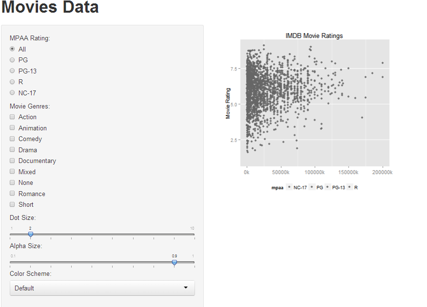

Homework 2: Interactivity
==============================

| **Name**  | Dinglin Huo  |
|----------:|:-------------|
| **Email** | dhuo@dons.usfca.edu |

## Instructions ##

The following packages must be installed prior to running this code:

- `ggplot2`
- `shiny`

To run this code please enter the following command in R

```
library(shiny)
shiny::runGitHub('msan622', 'dhuo', 'homework2')
```
###Transformation###
To performed a transformation on the data `movies`:
```R
genre <- rep(NA, nrow(movies))
  count <- rowSums(movies[, 18:24])
  genre[which(count > 1)] = "Mixed"
  genre[which(count < 1)] = "None"
  genre[which(count == 1 & movies$Action == 1)] = "Action"
  genre[which(count == 1 & movies$Animation == 1)] = "Animation"
  genre[which(count == 1 & movies$Comedy == 1)] = "Comedy"
  genre[which(count == 1 & movies$Drama == 1)] = "Drama"
  genre[which(count == 1 & movies$Documentary == 1)] = "Documentary"
  genre[which(count == 1 & movies$Romance == 1)] = "Romance"
  genre[which(count == 1 & movies$Short == 1)] = "Short"
  movies$genre = as.factor(genre)
  
  submovies <- subset(movies, budget>0)
#Filter out any rows that have a non valid mpaa rating in mpaa column
submovies <- subset(movies, mpaa !="" )

thousand_formatter <- function(x) {
  return(sprintf("%dk", round(x / 1000)))
} 
```
#### Discussion ####
The R code above will make these three changes:
- Filter out any rows that do not have a valid `budget` value greater than 0. 
- Filter out any rows that do not have a valid MPAA rating in the `mpaa` column.
- Add a `genre` column to the `movies` dataset as follows
- make `budget` shown as in `k` instead of `000`


###Visualizations Discussion###
------------------------------
About this graph, is that it can change the color of the graph through Color Scheme, also you can change the `Dot Size` and `Dot Alpha` through the sliderbar.
According to the setting requirement, the plot is default to show all MPAA rating on the graph.And if you want to see some specific genre or MPAA rating , you could go ahead and click the corresponsing tag on the sidebar.

Below is an  interface:



###Customization###
------------------------------
My customization is I change the `budget` and let in shown in k with out in so many zero numbers, so it is more clear to see and save space on the X-axis
.Also, I set the plot with out x major grid and with out y minor grid, which I believe will make the interface look more clear.
and I make the x axis budget text size=12.
About the legend, I set the position at the bottom, so it is visually more clean to see tahn on the side, it's more comparable for the dot, also, I set the direction as horizonal.
for the `ui.r` part, I customize the width and height of the scatterplot.


