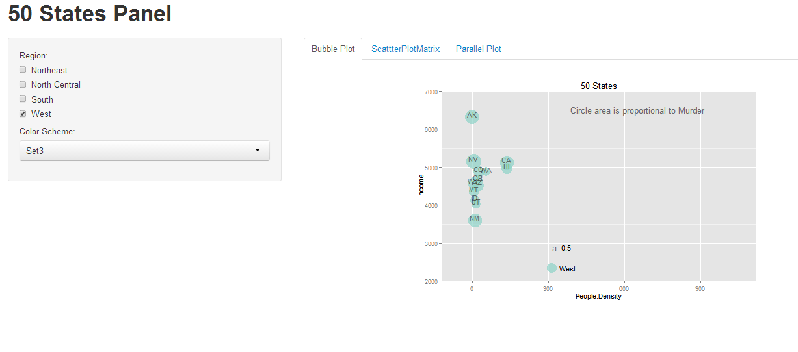
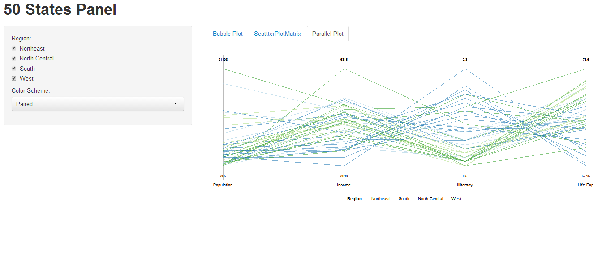

Homework [#]: [HOMEWORK NAME]
==============================

| **Name**  | Dinglin Huo  |
|----------:|:-------------|
| **Email** | dhuo@dons.usfca.edu |

## Instructions ##

Use the following code to run this `shiny` app
```
library(shiny)
runGitHub("msan622", "dhuo", subdir = "homework3")
```

## Discussion ##

[DISCUSSION: Include a discussion here if required by the assignment.]
## Discussion ##
```
df <- data.frame(state.x77,
                 State = state.name,
                 Abbrev = state.abb,
                 Region = state.region,
                 Division = state.division)
```
creat the data frame, and use 
 set side bar as Regions to sort the states name from the bubble plot, the plot use poplulation density as the x-axis, and income as the y-axis, and the bubbles represent for the muder amount in each state.
### Technique 1: Bubble ###



[DISCUSSION]
I used the cutomized color scheme brewer to be able to color the bubble plot, also extended the x and y axis by usethe `theme` function, and fix and locate the legend at the bottom. also use the `Regions` to sort the states to be able to intereact.
### Technique 2: scatterplot matrix ###


[DISCUSSION]
I used Population, income, illetercy and life exp to creat a parallel plot, and same, I use the color sort by regions of the 50 states, so 4 color represent four regions, and same, color scheme to contral the brewer, and region bar to control to region to be able to sort the plot. and a legen at the bottom of the plot to show the color represented for each region
### Technique 3: Parrelle plot ###



[DISCUSSION]

### Interactivity ###


[DISCUSSION]
