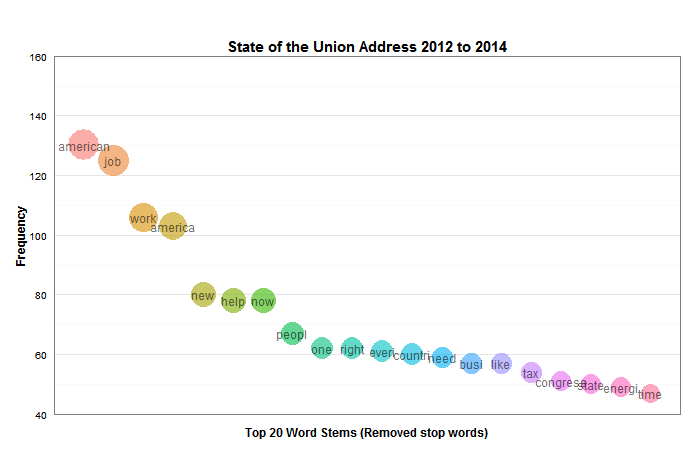
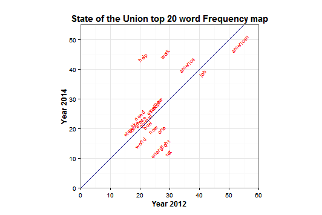
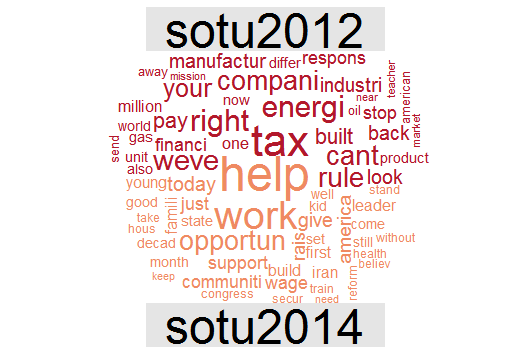

Homework [4]: [Text Visualization]
==============================

| **Name**  | Dinglin Huo  |
|----------:|:-------------|
| **Email** | dhuo@dons.usfca.edu |

## Instructions ##
To run this code require the following packages `tm`,`SnowballC`,`ggplot2`,`scales`,`reshape`,`wordcloud`.

```R
require(tm)        # corpus
require(SnowballC)
require(wordcloud) # word cloud
require(ggplot2)
library(scales)
require("reshape")
```

## Discussion ##
Text data source `state of the union`, I include the folder of state of union 2012 and 2014 in the github hw4 folder.
I generated three visualizations with three techniques:
- Bubble Plot
- text plot
- World Cloud

By using `ggplot2` and `WordCould` packages, I am able to generate three different techniques.

Use the `tm` package to process the text data
```
# change text to lower levels use tm_map
sotu_corpus <- tm_map(sotu_corpus,tolower)
# remove intra word dash line
sotu_corpus<-tm_map(sotu_corpus, removePunctuation, preserve_intra_word_dashes = TRUE)
# remove stop words
sotu_corpus<- tm_map(sotu_corpus, removeWords,stopwords("english"))
# remove numbers
sotu_corpus <- tm_map(sotu_corpus, removeNumbers)
# getStemLanguages()
sotu_corpus<-tm_map(sotu_corpus, stemDocument, lang="english")
#remove specific word
sotu_corpus<-tm_map(sotu_corpus,removeWords,c("will","this","that","can","get","year","let","make","said"))
# remove white space
sotu_corpus<-tm_map(sotu_corpus,stripWhitespace)
```
Also convert data to matrix frame and `order` by `frequency` level, remove `rownames`


###Bubble Plot###


I chosed the top 20 frequency words in all three state of the union speeches, and plot them by Bubble Plot,
I used `x-axis` as `word` and `y-axis` as `freq`, colour them by different colour, and the size of the bubbles differs as the frequency changes.
using a `theme_bw()` undertone, and an `bold` value for x,y axis to make the text show clearer,I also removed the padding for the x-axis and y-axis, to avoid wast of space, 
I removed the legend as there is no need for legend indicate the words,I also removed the ticks to make the image more clean, removed the text on the `x-axis` as I put the text on the bubbles
so it's more easy to read, I removed the grid for `x-axis`, as there is no need to compare with the x-grid, since only comparing the `freq` here. so I only left the `y-grid`

### Co-Occurance Frequency Plot###


I chosed the state of the union 2012 and state of the union 2014 script as a comparison here to plot the same word that have the highest frequency in both scripts,
after created my new data frame, I chosed the top 20 frequency words of all three state of the union texts, and I set the `x-axis` as the `sotu2012`, while the `y-axis` as the `sotu2014`
I used the text plot to plot the top 20 frequency words, by setting an angle `45` degree to make it not overlapp the words with each other, 
with the position set to `jitter` to avoid overlap, I include an `abline` function here to add a general trend of the words on the plot, with a `45` degree trend, with teh `ratio` set to 1/2 
the coord make it 1:1 ratio, and I use`red` color and `navy` colour to contradict the visual feeling, make it pop out, as the `theme` function, I `bold` the line and text for `axis` .
By setting the `lim()` to control no extra padding in the plot.
### World Cloud###



I use the comparison world cloud to compare the most frequency words in either ` sotu12` and `sotu14` file, and with one on top and 
the other on bottom, with the most frequency word showed up in the center with comparably bigger area, and smaller word represent for smaller word frequency.
I use the `colour_brewer` `RdBu` to generate contradictory colour, and with a `max` value set up to be able to include more words.

