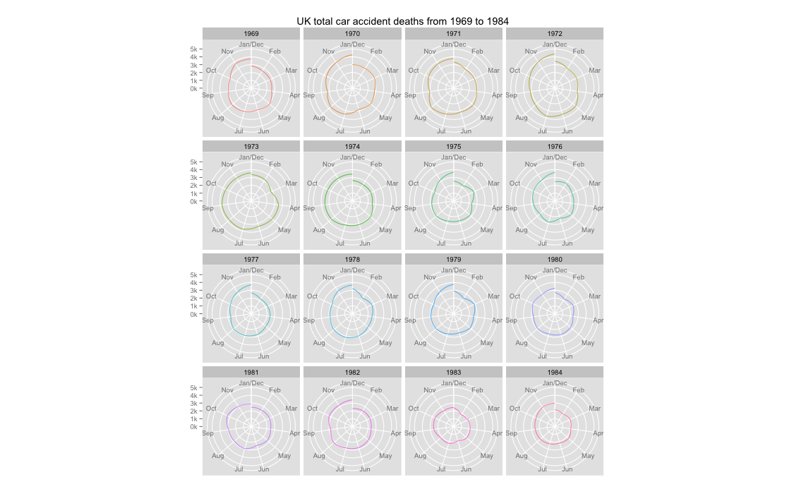

Homework [5]: [Time Series Visualization]
==============================

| **Name**  | dhuo |
|----------:|:-------------|
| **Email** | dhuo@dons.usfca.edu |

## Instructions ##

You will need to have the following packages to run my code:
```
`ggplot2`
`reshape2`
`grid`
`scales`

## Discussion ##

### Arrange Dataset###
 Set the time series ID `time` `year` `month`, set `order` to these IDs, add Abbreviations to months, and build dataframe for creat plots. I melted my dataset for furthur use, so required package `reshape2`.

 ### Set scales to beautify the plots###
I set scales for `scale_year`,`scale_months`,`scale_SB which is my main data frame, `scale_prgn` for continuous gradient scale, `theme_heatmap`, `theme_legend`,`theme_guide`.

### Technique 1: Time Series Stacked Area Plot###

I used drivers, front passenger, rear passenger in my first vidualization technique, I add color brewer `Pastel2` for a more contrast color display, use package `grid` to modify the panel backgrand, fix the mior and major grid to easy to measure the stacked area, remove the title for x-axis since they are years, and modify the y-axis text to `k` form, so save space, adjust the legend to a reasonable size to fit in the plot,  add `annotate` to lower position of the plot and set `alpha`=0.6 to avoid blocking the graoh, and the innotation explained the legend abbreviations' representations. use `ratio` to match the square rectangle of the plot` 


### Technique 2: heatmap###

I melted the dataset `SB` to my ideal subset `mydata2`, and only use the total deaths as the only variable in my heatmap. i set the heatmap color to `Spectral` from my scale ` scale_prgn()`, and customize my panel axis text size, remove the titles for the axis for both x and y, and flip the heatmap, and set `year` on the horizonal axis, red represent for smaller deaths number, while blue represent for a larger deaths number.

### Technique 3: Multiple Circle Plot ###

I used the `total` number of death people in the car accident in this technique, and  add my scales to beautify the display, I removed the legend and set the mutli facet coloumn to 4, and set the ratio to 1/1000, remove the axis title for both x and y.


I am not very satisfied with my heatmap overall, since I dont know how to fix the number label below the legend, and for the multiple circle line plot, I wish I could put all the plot in one circle, but somehow I dont know how to, and I would like to try use shiny but it is complicated for me, since i have trouble with the shiny server code and the UI code.


